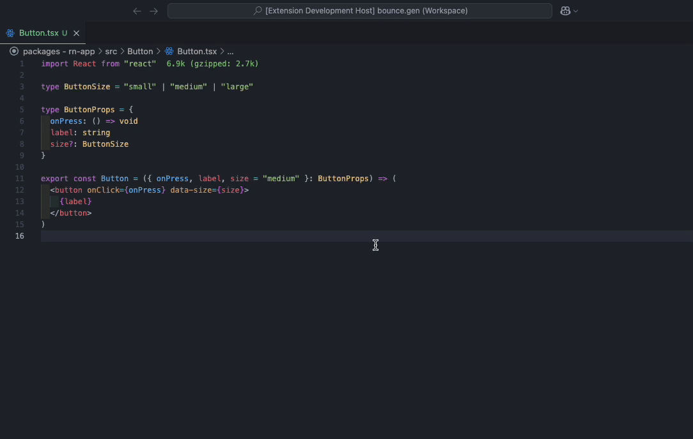

# 🤖 Storybook Generator

A Visual Studio Code Generator to create Storybook stories from your components real quick.

Open the tsx file that contains the component for which you want to create a story, then from the command palette run.

<kbd>⌘ Command</kbd> + <kbd>⇧ Shift</kbd> + <kbd>P</kbd>

and type

`"Story: Create a Storybook Storybook"`

A new _unsaved_ file will be created with the basics of a Storybook story in the Component Story Format (CSF) filled out for you. Move between the placeholders with TAB, customize the names as you want and you are done.

The extension will try to understand the properties it takes filling them out for you with some placeholders, or a default value if available.

---

Credits: This extension is an extension and update of riccardo-forina's brilliant extension (riccardo-forina/storybook-vscode-helper)
